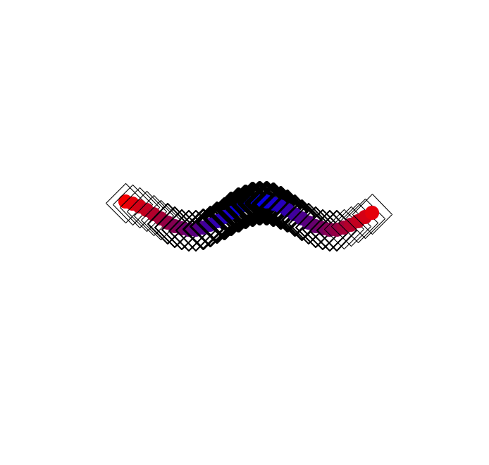
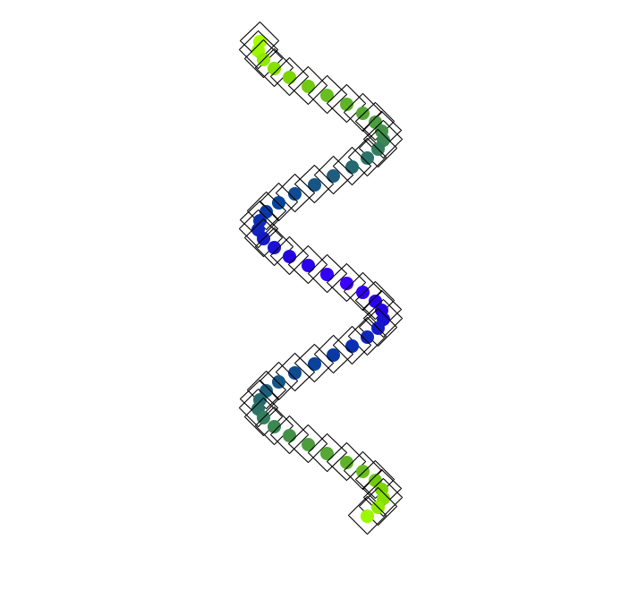

# Tartle
Generative art with Python and Turtle

Images captured automatically upon drawing completion usin Pillow.

&nbsp;
## Examples

&nbsp;
tartle 01
&nbsp;

&nbsp;
tartle 02
&nbsp;

&nbsp;
tartle 03
&nbsp;

&nbsp;
tartle 07
&nbsp;

&nbsp;
tartle 08
&nbsp;

&nbsp;
tartle 09
&nbsp;

&nbsp;
tartle 10
&nbsp;
