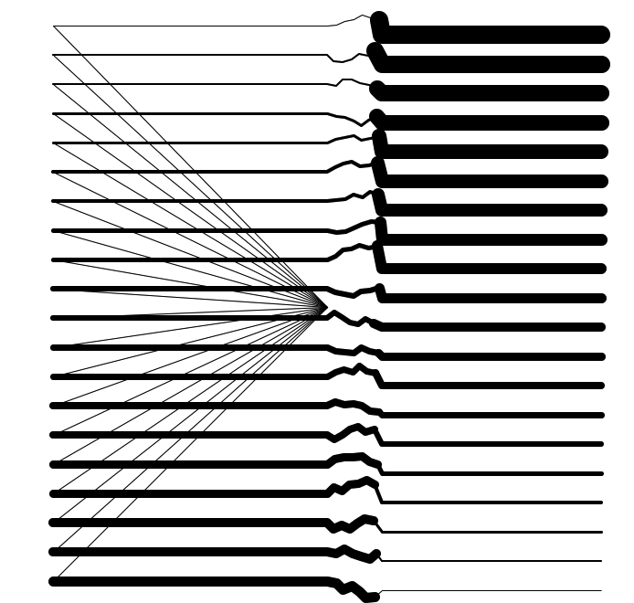

# Tartle
Generative art with Python and Turtle

Pillow ImageGrab when drawing finishes.

&nbsp;
## Examples

&nbsp;
tartle 01
&nbsp;

&nbsp;
tartle 02
&nbsp;

&nbsp;
tartle 03
&nbsp;

&nbsp;
tartle 04
&nbsp;

&nbsp;
tartle 05
&nbsp;

&nbsp;
tartle 06
&nbsp;

&nbsp;
tartle 07
&nbsp;

&nbsp;
tartle 08
&nbsp;

&nbsp;
tartle 09
&nbsp;

&nbsp;
tartle 10
&nbsp;

&nbsp;
tartle 11
&nbsp;

&nbsp;
tartle 12
&nbsp;

&nbsp;
tartle 13
&nbsp;

&nbsp;
tartle 14
&nbsp;

&nbsp;
tartle 15
&nbsp;

&nbsp;
tartle 16
&nbsp;

&nbsp;
tartle 17
&nbsp;

&nbsp;
tartle 18
&nbsp;

&nbsp;
tartle 19
&nbsp;
