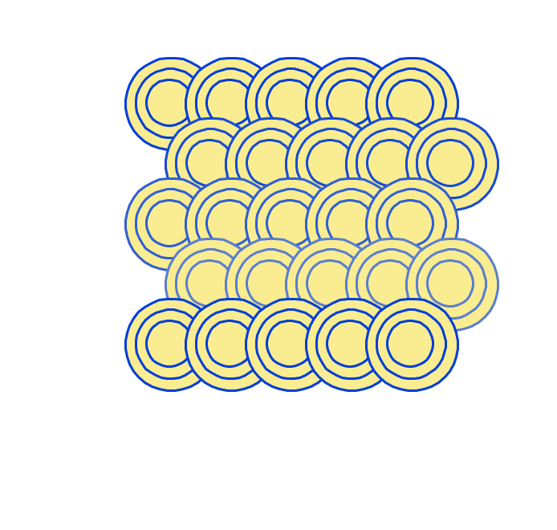

# Tartle
Generative art with Python and Turtle

Pillow ImageGrab when drawing finishes.

## Usage
1. Clone the repository
2. Open tartle.py
3. Set line 3 to the desired drawing number
- `tartle23.tart` for drawing 23
4. In a terminal window, run `python tartle.py`
5. Press `R` when the Python Turtle Graphics window opens
6. Observe the drawing
7. Adjust the tart.py to customize the drawing

## Features
* User controlled drawing animation
* Boilerplate code for customization
* Screen capture of completed art (using ImageGrab)
* Automatic saving of image file in respective folder

&nbsp;
## Examples

&nbsp;
tartle 07
&nbsp;

&nbsp;
tartle 08
&nbsp;

&nbsp;
tartle 09
&nbsp;

&nbsp;
tartle 10
&nbsp;

&nbsp;
tartle 11
&nbsp;

&nbsp;
tartle 12
&nbsp;

&nbsp;
tartle 13
&nbsp;

&nbsp;
tartle 14
&nbsp;

&nbsp;
tartle 15
&nbsp;

&nbsp;
tartle 16
&nbsp;

&nbsp;
tartle 17
&nbsp;

&nbsp;
tartle 18
&nbsp;

&nbsp;
tartle 19
&nbsp;

&nbsp;
tartle 20
&nbsp;

&nbsp;
tartle 21
&nbsp;

&nbsp;
tartle 22
&nbsp;

&nbsp;
tartle 23
&nbsp;

&nbsp;
tartle 24
&nbsp;

&nbsp;
tartle 25
&nbsp;
