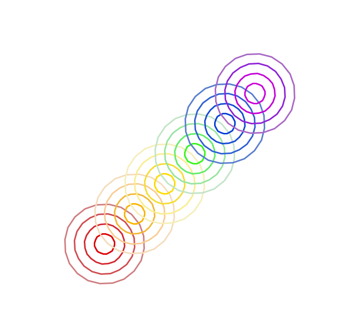
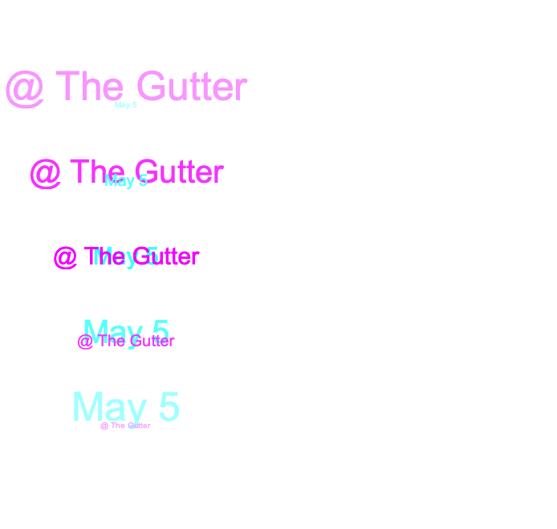

# Tartle
This project explores the procedural aspects of geometric drawing using the Python Turtle graphics library.
An image (PNG) of each generated drawing is grouped with the respective program used to create it.
Drawings are separated into numbered folders.

## Requirements
Python3 (v3.9.7 or greater)

## Usage
1. Clone the repository
2. Open tartle.py
3. Set line 3 to the desired drawing number
- `tartle23.tart` for drawing 23
4. In a terminal window, navigate to the local directory
5. Run `python tartle.py`
5. Press `R` when the window opens
6. Observe the drawing
7. Adjust the tart.py file to customize the drawing

## Features
* User controlled drawing animation
* Boilerplate code for customization
* Screen capture of completed art (using ImageGrab)
* Automatic saving of image file in respective folder

## Examples

	
	
	

	
	
	

	
	
	

	
	
	

	
	
	

	
	
	

	
	
	

	
	
	

	

## Contributing
Want to contribute? Please fork the repo and submit a pull request.
Or if you have any ideas about the project I'd love to hear! Feel free reach out.
